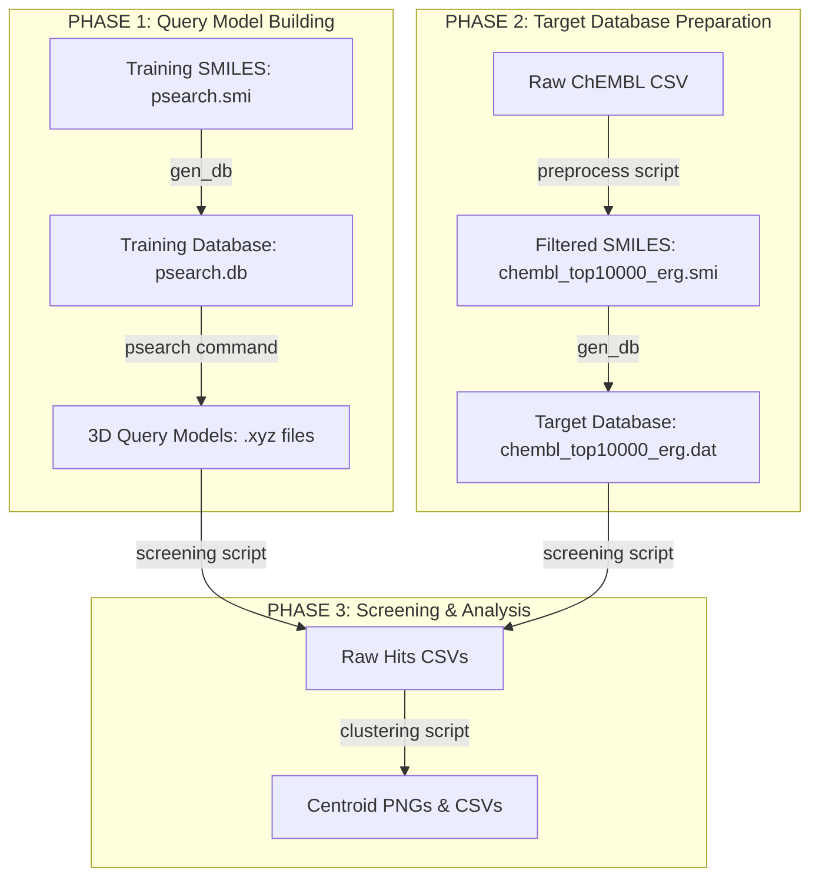

# Step-by-Step PSearch Pipeline: From Training Data to Screened Hits

This directory contains the self-contained pipeline scripts, processed datasets, and commands to run preprocessing, 3D query construction (generation of `.xyz` pharmacophores), virtual screening, and clustering.

---

## 1. Prerequisites & Installation

The pipeline requires `RDKit`, `Pandas`, `pmapper`, and `psearch` packages.

To install the environment:
```bash
# Create and activate environment
conda create -n psearch_env python=3.10 -y
conda activate psearch_env

# Install dependencies
conda install -c conda-forge rdkit pandas -y
pip install pmapper
pip install git+https://github.com/mti-lab/psearch.git
```

---

## 2. Complete Pipeline Workflow



---

## Phase 1: Query Model Building (Generating `.xyz` files)

### Input Data
* **Training file (`psearch.smi`)**: A tab-separated SMILES file containing three columns: `smiles`, `mol_name`, and `activity` (where `1` designates active molecules and `0` designates inactives).
* **Important Note**: Inactive molecules are critical as negative controls. PSearch uses them to filter out non-selective pharmacophore combinations, ensuring generated queries are highly specific to active compounds.

### Step 1: Conformer Database Generation for Training Set
Before building models, generate the 3D conformers for all training molecules.
```bash
gen_db -i psearch.smi -o psearch.db -n 50 -s 5 -c 64 -v
```
* **Parameters**:
  - `-n 50`: 50 conformers per stereoisomer (gives dense conformational coverage).
  - `-s 5`: Generate up to 5 stereoisomers for unspecified chiral centers.
  - `-c 64`: Scale to 64 CPU cores.
* *Outputs:* `psearch.db` (binary conformer database) and `psearch.dir`.

### Step 2: 3D Pharmacophore Query Construction (`.xyz` files)
Build the 3D queries by identifying common features in the active molecules that are absent in the inactives.
```bash
psearch -i psearch.smi -d psearch.db -p psearch_models -c 64 -t 0.4 -m 2 -l 3 -f 5
```
* **Parameters & Tuning Guide**:
  - `-t 0.4` (Clustering threshold): Actives are clustered using Butina clustering. A threshold of `0.4` (Tanimoto distance) groups molecules of similar scaffolds. Lowering the threshold (e.g. `0.3`) creates more, smaller clusters; raising it (e.g. `0.6`) merges different scaffolds into a single cluster.
  - `-m 2` (Training Mode): Mode `2` builds a separate training set per cluster (generating files named `t0`, `t1`, etc.). Mode `1` builds a single training set using cluster centroids. Mode `2` is recommended to capture multiple distinct binding modes.
  - `-l 3` (Lower limit): Starting size of the pharmacophore features (e.g. starts searching from 3-point models).
  - `-f 5` (Save complexity): Only save pharmacophores having at least 5 features. Keeps queries restrictive and highly selective.
  - `-tol 0` (Tolerance): Coordinates tolerance for enantiomer generation.
  - `-c 64`: Utilize 64 CPU threads for parallel query validation.
* *Outputs:* Saved under the `psearch_models/models/` directory:
  - **`psearch.t0_f6_p0.xyz`** (Cluster 0, 6 features, candidate model 0)
  - **`psearch.t1_f8_p0.xyz`** (Cluster 1, 8 features, candidate model 0)
  - **`psearch.t1_f8_p1.xyz`** (Cluster 1, 8 features, candidate model 1)

---

## Phase 2: Target Database Preparation

### Step 3: Preprocess and Filter ChEMBL
Cleans the raw ChEMBL database (salt stripping, charge neutralization) and selects the top 10,000 compounds most similar to the reference `mol57` via ErG similarity.
```bash
python preprocess_and_filter_chembl.py -i <path_to_chembl_data.csv> -o chembl_top10000_erg.smi -s chembl_top10000_erg_scores.csv -c 64
```
* *Outputs:* `chembl_top10000_erg.smi` and `chembl_top10000_erg_scores.csv`.

### Step 4: 3D Conformer Generation for Target Database
Generates the conformers of the 10,000 target compounds.
```bash
gen_db -i chembl_top10000_erg.smi -o chembl_top10000_erg.dat -n 50 -s 5 -c 64 -v
```
* *Outputs:* `chembl_top10000_erg.dat` and `chembl_top10000_erg.dir`.

---

## Phase 3: Screening & Analysis (Using the `.xyz` files)

### Step 5: Run Virtual Screening
Aligns the 10,000 target database conformers to the query `.xyz` files generated in **Step 2**.
```bash
python run_chembl_top10000_screening.py -d chembl_top10000_erg.dat -i chembl_top10000_erg.smi -q psearch_models/models/ -o screening_results_top10000
```
* **How `.xyz` files are used here**: The screening script loads each query `.xyz` file (e.g. `psearch.t0_f6_p0.xyz`) and checks every 3D shape in `chembl_top10000_erg.dat`. If all point constraints match, it records the compound ID.
* *Outputs:* 
  - `hits_psearch.t0_f6_p0_top10000.csv`
  - `hits_psearch.t1_f8_p0_top10000.csv`
  - `hits_psearch.t1_f8_p1_top10000.csv`

### Step 6: Hit Clustering & Selection
Group matches by fingerprint similarity to extract diverse centroids for testing/docking.
```bash
python cluster_top10000_hits.py -c 0.40
```
* *Outputs:* Centroid lists and visualization grids (e.g. `hits_psearch.t0_f6_p0_top10000_clusters.png`).
